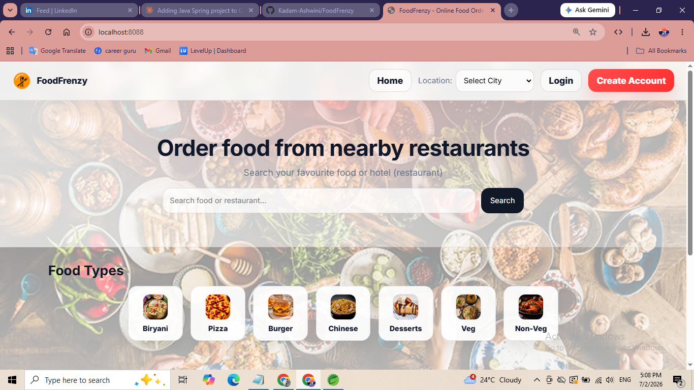

# 🍽️ FoodFrenzy — E-Food Hub

**FoodFrenzy** is a web-based online food ordering and delivery platform that connects **customers**, **restaurants**, and **delivery partners** on a single system. Inspired by platforms like Swiggy and Zomato, it lets users browse restaurants, explore menus, place orders, pay securely, track deliveries in real time, and leave feedback — all from one place.

> Developed by **Ashwini Kadam**

---

## 📖 About the Project

Traditional food ordering methods (phone calls, in-person visits) are slow, error-prone, and lack transparency. **E-Food Hub** solves this by offering a centralized digital platform where:

- Customers can browse, order, pay, and track food deliveries.
- Restaurant owners can manage menus and incoming orders.
- Admins can oversee users, restaurants, orders, and generate reports.
- Delivery agents are assigned and tracked in real time.

---

## ✨ Features

- 🔐 **User Authentication** — secure registration & login for customers and admin
- 🤖 **AI-Based Food Recommendations** — personalized suggestions based on order history
- 🏪 **Restaurant Management** — add/update menus, pricing, and availability
- 🛒 **Cart & Order Management** — add/remove items, adjust quantity, checkout
- 💳 **Secure Payments** — UPI, card, and Cash on Delivery support
- 🚚 **Delivery Tracking** — real-time order status and live location tracking
- 🔔 **Notifications** — order confirmation, preparation, and delivery updates
- 🛠️ **Admin Dashboard** — manage users, restaurants, orders, and view analytics
- ⭐ **Customer Feedback** — ratings and reviews for restaurants/orders
- 📊 **Reports & Analytics** — revenue, order status distribution, top-selling items

---

## 🧰 Tech Stack

| Layer            | Technology              |
|-------------------|--------------------------|
| Backend           | Java, Spring Boot        |
| Frontend          | HTML, CSS                |
| Database          | MySQL                    |
| Build Tool        | Maven                    |
| IDE               | Spring Tool Suite (Eclipse) |
| Web Server        | Apache Tomcat (embedded) |

---

## 🏗️ Project Architecture

The application follows a layered Spring Boot architecture:

```
com.app.food
├── bootstrap        # Application startup/data seeding
├── config           # Application configuration
├── controller        # REST/MVC controllers
├── model             # Entity classes (User, Restaurant, FoodItem, Order, etc.)
├── repository         # Spring Data JPA repositories
│   └── projection    # Repository projections
├── service            # Business logic
└── tracking           # Delivery/order tracking logic
```

### Core Modules

1. **User Authentication Module** – Register/Login for customers & admin
2. **AI-Based Recommendation Module** – Suggests food based on user behavior
3. **Restaurant Module** – Menu & order management for restaurant owners
4. **Food Module** – Manages food item details
5. **Cart & Order Module** – Cart handling and order placement
6. **Payment Module** – Handles transactions (UPI/Card/COD)
7. **Delivery Module** – Assigns and tracks delivery agents
8. **Notification Module** – Order/delivery status alerts
9. **Admin Module** – Manages users, restaurants, and orders
10. **Report & Dashboard Module** – Sales and performance analytics

---

## 🗄️ Database Design

Key tables include: `app_user`, `restaurant`, `food_item`, `cart`, `cart_item`, `orders`, `order_item`, `delivery_agent`, `delivery_location`, `payment_transaction`, and `feedback`.


## 🚀 Getting Started

### Prerequisites

- Java 17+
- Maven (or use the bundled `mvnw` wrapper)
- MySQL Server
- An IDE such as Spring Tool Suite / Eclipse / IntelliJ IDEA (optional)

### 1. Clone the repository

```bash
git clone https://github.com/Kadam-Ashwini/FoodFrenzy.git
cd FoodFrenzy
```

### 2. Configure the database

Create a MySQL database:

```sql
CREATE DATABASE foodfrenzy;
```

Update `src/main/resources/application.properties` with your DB credentials:

```properties
spring.datasource.url=jdbc:mysql://localhost:3306/foodfrenzy
spring.datasource.username=root
spring.datasource.password=your_password
spring.jpa.hibernate.ddl-auto=update
```

### 3. Run the application

Using the Maven wrapper:

```bash
./mvnw spring-boot:run
```

Or on Windows:

```bash
mvnw.cmd spring-boot:run
```

The app will start at:

```
http://localhost:8088
```

---
## 📸 Screenshots

### Home Page


### Login


### Admin Dashboard


### Cart & Checkout


### Order Tracking


## 👥 Stakeholders

| Role | Responsibilities |
|------|-------------------|
| **Customer** | Browse restaurants, place orders, make payments, track delivery, give feedback |
| **Restaurant Owner** | Manage menu & items, accept/reject orders |
| **Delivery Partner** | Receive and deliver orders, update status |
| **Admin** | Manage users, restaurants, orders, and monitor system performance |
| **Payment Gateway** | Process secure transactions (UPI/Card/Wallets) |

---

## 🔮 Future Enhancements

- AI/ML-based smarter personalized recommendations
- Native mobile app (Android/iOS)
- Real-time GPS-based delivery tracking
- Chatbot & voice-based ordering
- Loyalty programs and discount offers
- Advanced analytics dashboards for restaurants/admin
- Social media integration for reviews & sharing

---

## ⚠️ Limitations

- Requires a stable internet connection for ordering, payment, and tracking
- Relies on delivery partner availability for timely service
- No direct control over food quality prepared by restaurants
- Faces competition from established platforms like Swiggy/Zomato

---

## 📚 References

- Sommerville, I. — *Software Engineering* (10th ed.), Pearson Education
- Silberschatz, Korth & Sudarshan — *Database System Concepts*
- Grinberg, M. — *Flask Web Development*
- Tahaghoghi & Williams — *Learning MySQL*
- Robson & Freeman — *Head First HTML and CSS*
- [Spring Boot Documentation](https://docs.spring.io/spring-boot/)
- [MySQL Documentation](https://dev.mysql.com/doc/)
- [MDN Web Docs](https://developer.mozilla.org/)

---

## 👩‍💻 Author

**Kadam Ashwini**
